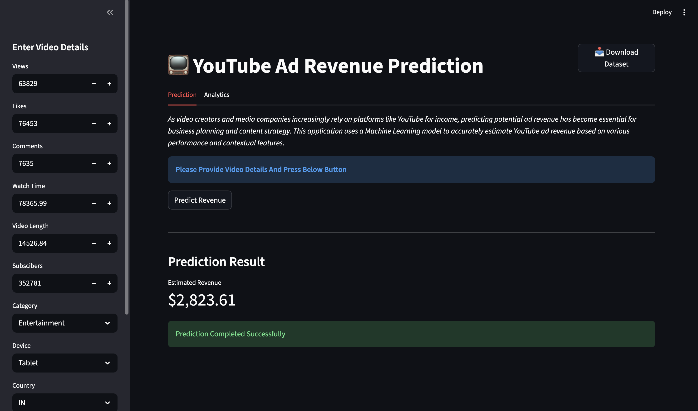
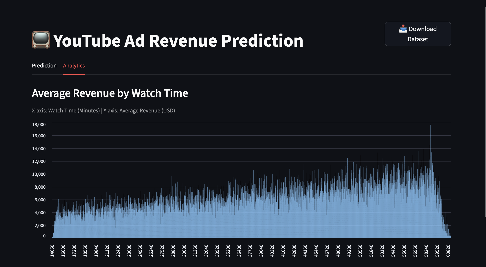
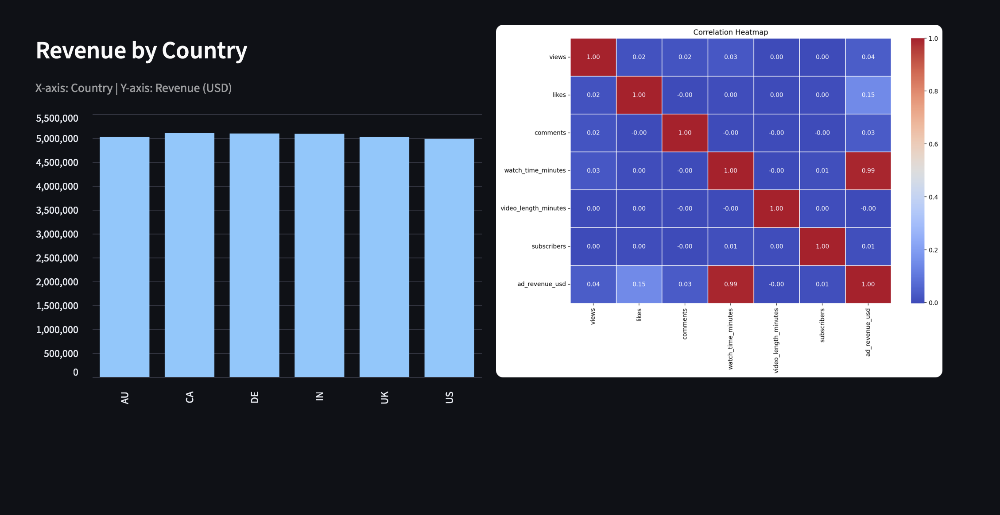

# YouTube Monetization Modeler - Ad Revenue Prediction

## Project Overview

This project predicts the **YouTube Ad Revenue (USD)** generated by a video using Machine Learning. The objective is to help content creators, media companies and advertisers estimate potential earnings based on video performance metrics and contextual information.

The project includes:

- Data preprocessing
- Exploratory Data Analysis (EDA)
- Feature Engineering
- Multiple Regression Models
- Model Evaluation
- Streamlit Web Application for Predictions


## Business Use Cases

- **Content Strategy Optimization**
  - Identify which content characteristics generate higher revenue.

- **Revenue Forecasting**
  - Predict earnings before publishing new videos.

- **Creator Analytics**
  - Support creators with data-driven monetization insights.

- **Advertising Planning**
  - Help advertisers estimate campaign ROI.

---

## Dataset

**Dataset:** 

- Format: CSV
- Size: ~122,000 records

### Target Variable

- `ad_revenue_usd`

### Features

| Feature | Description |
|----------|-------------|
| video_id | Unique video identifier |
| date | Upload/Report date |
| views | Total video views |
| likes | Number of likes |
| comments | Number of comments |
| watch_time_minutes | Total watch time |
| video_length_minutes | Video duration |
| subscribers | Channel subscribers |
| category | Video category |
| device | Device type |
| country | Country |
| ad_revenue_usd | Target variable |

---

## Project Workflow

### 1. Data Loading

- Loaded dataset
- Inspected data types
- Checked missing values
- Identified duplicates

### 2. Exploratory Data Analysis (EDA)

Performed:

- Correlation Analysis
- Outlier Detection
- Feature Relationships
- Data Visualization

---

### 3. Data Preprocessing

- Missing value handling
- Duplicate removal
- One-Hot Encoding
- Feature Scaling
- Data Cleaning

---

### 4. Feature Engineering

Created meaningful features such as:

- Engagement Rate
- Likes Ratio
- Encoded categorical variables

---

### 5. Model Building

The following regression models were trained and compared:

- Linear Regression
- Decision Tree Regressor
- Random Forest Regressor
- KNeighbors Regressor

The best performing model was selected (Linear Regression) based on evaluation metrics.

---

## Model Evaluation

The models were evaluated using:

- R² Score
- Mean Absolute Error (MAE)

---

## Technologies Used

- Python
- Pandas
- Matplotlib
- Seaborn
- Scikit-learn
- Streamlit

---

## Project Structure

```
CONTENT_MONETIZATION_MODELER/
│
├── Data/
│   └── youtube_ad_revenue_dataset.csv
│
├── Screenshots/
│   └── Analysis_1_screenshot.png
│   └── Analysis_2_screenshot.png
│   └── Prediction_screenshot.png
│   
├── Data_Preprocessing.ipynb
├── EDA.ipynb
├── Loading_dataset.ipynb
├── Model_building.ipynb
│
├── Youtube_AD_Revenue.py
├── model.pkl
├── scale.pkl
├── feature_names.pkl
│
├── requirements.txt
├── README.md
└── .gitignore
```

---

## Installation

Clone the repository

```bash
git clone https://github.com/ukesh2603/Youtube_AD_Revenue_Prediction
```

Navigate to the project directory

```bash
cd Youtube_AD_Revenue_Prediction
```

Install dependencies

```bash
pip install -r requirements.txt
```

---

## Run the Streamlit Application

```bash
streamlit run Youtube_AD_Revenue.py
```

The application will open in your default web browser.

---

## Features of the Streamlit App

- Predict YouTube Ad Revenue
- User friendly input interface
- Revenue trend analysis based on watch time
- Country wise revenue visualization
- Correlation heatmap between features

---
## Application Preview

### Revenue Prediction



### Analytics Dashboard





---

## Expected Outcomes

- Accurate ad revenue prediction
- Clean and processed dataset
- Interactive prediction application

---

## Future Improvements

- Hyperparameter tuning
- Advanced Feature Engineering
- Deep Learning Models
- Model Deployment on Cloud
- Real YouTube API Integration

---

## ⭐ If you found this project useful

Please consider giving this repository a ⭐ on GitHub.
